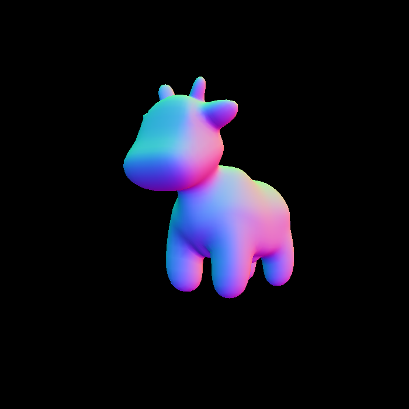

# Overall 
This project implements the complete shading pipeline, which includes vertex processing, triangle processing, rasterization, fragment processing, and framebuffer operations. In my previous projects, [model view projection](https://github.com/Yuqian-He/model-view-projection) and [rasterizer triangle](https://github.com/Yuqian-He/rasterize-triangle), I implemented various stages of this pipeline, including vertex processing, triangle processing, and rasterization. However, this project builds upon my previous work by incorporating more complex models and support for texture mapping, achieved through the use of vertex and fragment shaders.

# Development environment
- build system generator: [CMake](https://cmake.org/)
- build system: [Ninja](https://ninja-build.org/)
- compiler: [GCC 12.2.0 aarch64-apple-darwin22](https://linux.die.net/man/1/gcc)
- Integrated Development Environment (IDE): [Visual Studio Code](https://code.visualstudio.com/) 
- C++ libraries:
  - C++ Standard Library
  - [Eigen3](https://eigen.tuxfamily.org/index.php?title=Main_Page)
  - [openCV2](https://opencv.org/)
  - automated testing: [Google Test](https://github.com/google/googletest)
- package manager: [vcpkg](https://github.com/Microsoft/vcpkg)
- version control system (VCS): [Git](https://git-scm.com/)

# Method

## rasterize_triangle
Building upon my previous project, this part not only interpolates depth values, but also takes into account the texture associated with each pixel. To enable this functionality, a new class called "Texture" was introduced to store the input image, and a new Triangle attribute call "texCoord" to map the texture uv coordinate with geometry vertices information(as referenced from [LEI XU](http://games-cn.org/forums/topic/%e4%bd%9c%e4%b8%9a3%e6%9b%b4%e6%ad%a3%e5%85%ac%e5%91%8a/)'s code). 
### Algorithm Outline
```c++
// Find out the bounding box of current triangle
int boundingBox_xLeft= MIN(triangle[0].x,triangle[1].x,triangle[2].x)
int boundingBox_xRight=MAX(triangle[0].x,triangle[1].x,triangle[2].x)
int boundingBox_yLeft=MIN(triangle[0].y,triangle[1].y,triangle[2].y)
int boundingBox_yRight=MAX(triangle[0].y,triangle[1].y,triangle[2].y)

//iterate through each pixel and find out if the current pixel is inside the triangle 
for each boundingBox_pixel i do
    if(insideTriangle())
        //interpolated depth value, color, normal, texoords
        z = interpolated()
        color = interpolated()
        normal = interpolated()
        texoords = interpolated()
        //compare z with depth buffer, if small, store it in depth buffer and color the pixel use texture
        if(z<depth_buffer)
            depth_buffer=z
            loadColor=load(z,color,normal,texoords)
            pixel_color = fragment_shader(loadColor)
            setPixelColor(position,pixel_color)
end
```
### Barycentric Coordinates
In a triangle a point(x,y):

$$
(x,y)=\alpha \times A + \beta \times B + \gamma \times C
$$

$$
\alpha + \beta + \gamma = 1
$$

result:

$$
\alpha = \frac{-(x-x_{B})(y_{C}-y_{B})+(y-y_{B})(x_{C}-x_{B})}{-(x_{A}-x_{B})(y_{C}-y_{B})+(y_{A}-y_{B})(x_{C}-x_{B})}
$$

$$
\beta = \frac{-(x-x_{C})(y_{A}-y_{C})+(y-y_{C})(x_{A}-x_{C})}{-(x_{B}-x_{C})(y_{A}-y_{C})+(y_{B}-y_{C})(x_{A}-x_{C})}
$$

$$
\gamma = 1- \alpha - \beta
$$

> barycentric coordinate are not invariant under projection

## perspective projection
This part is the same as my [pervious work](https://github.com/Yuqian-He/model-view-projection), here are the formula

$$
M_{persp} = M_{ortho}M_{persp->ortho}
$$

$$
M_{persp->ortho} = 
   \begin{bmatrix}
   n&0&0&0\\
   0&n&0&0\\
   0&0&n+f&-nf\\
   0&0&1&0\\
   \end{bmatrix}
$$

$$
 M_{ortho} = 
  \begin{bmatrix}
  \frac{2}{r-1}&0&0&0\\
  0&\frac{2}{t-b}&0&0\\
  0&0&\frac{2}{n-f}&0\\
  0&0&0&1\\
  \end{bmatrix} 
  \begin{bmatrix}
  1&0&0&-\frac{r+1}{2}\\
  0&1&0&-\frac{t+b}{2}\\
  0&0&1&-\frac{n+f}{2}\\
  0&0&0&1\\
  \end{bmatrix} 
$$

## Blinn-Phong Reflection Model


# Building and Result
```c++
# Setup environment 

# Download repository
$ git clone git@github.com:Yuqian-He/Pipeline-and-Shading.git
$ cd Pipeline-and-Shading

# Configure and build project
$ mkdir build
$ cd build
$ cmake .. 
$ make

```

## normal shader
```c++
./Rasterizer output.png normal
```
